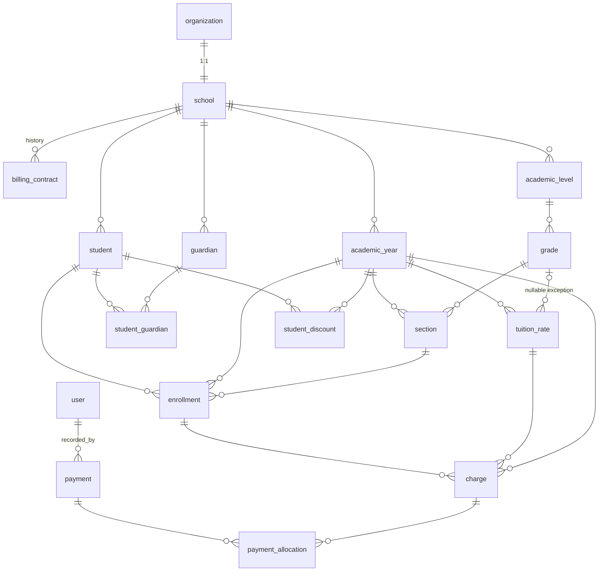

# Aulara Auth and Database Foundation

Shared authentication, multitenancy, and persistence foundation for the Aulara monorepo.

## Architecture: organization -> school

```text
user ──< member >── organization ── 1:1 ── school
                                             │
                                             ├── 1:N billingContract
                                             ├── 1:N academicYear
                                             ├── 1:N student
                                             ├── 1:N guardian
                                             └── rest of the domain
```

- Better Auth `organization` is the authentication/authorization tenant.
- Domain `school` is the educational and commercial root. One organization is exactly one school and vice versa.
- `organization.id` and `school.id` are independent UUIDs; `school.organizationId` is `NOT NULL`, `UNIQUE`, and `ON DELETE RESTRICT`.
- Every tenant-aware domain table carries `schoolId` (never `organizationId`).
- Better Auth tables use `organizationId`; Aulara domain tables use `schoolId`.

## Global roles vs organization roles

| Concept | Field | Values | Checked by |
|---|---|---|---|
| Global role | `user.role` | `user`, `admin` | `apps/admin` via `requireGlobalAdmin` |
| Organization role | `member.role` | `owner`, `admin`, `member` | `apps/platform` via `requireActiveSchool` |

- A `member.role = admin` does **not** make the user a global Aulara admin.
- A `user.role = admin` does **not** silently access school data; cross-school access goes through explicit admin functions (e.g. `provisionSchoolTenant`).
- Better Auth stores roles as comma-separated values; `getGlobalRole`/`parseOrganizationRoles` in `@aulara/auth/permissions` normalize them.

## Schema diagram



Cross-tenant integrity uses composite foreign keys:

```text
parent:  PRIMARY KEY (id)  +  UNIQUE (school_id, id)
child:   FOREIGN KEY (school_id, parent_id) REFERENCES parent(school_id, id)
```

## Packages

| Package | Owns | Depends on |
|---|---|---|
| `@aulara/env` | environment parsing (`DATABASE_URL`, `BETTER_AUTH_*`) | — |
| `@aulara/db` | Neon PostgreSQL client (`@neondatabase/serverless` + `drizzle-orm/neon-serverless`), schema, relations, migrations, queries | `@aulara/env` |
| `@aulara/auth` | single Better Auth server instance, vanilla browser client, CORS, guards, school context | `@aulara/db`, `@aulara/env` |
| `@aulara/core` | server-only domain services (provisioning, billing, tuition, payments) | `@aulara/db`, `@aulara/auth` |

`db` never imports `auth`, `core`, or an app. `apps/platform` is the canonical auth host; `apps/admin` consumes the same backend through the shared client. `apps/web` imports none of these.

## Environment variables

Copy `.env.example` to `.env` and fill real values:

```text
DATABASE_URL                    # Neon PostgreSQL connection string
BETTER_AUTH_SECRET              # >= 32 characters
BETTER_AUTH_URL                 # e.g. http://localhost:3000
BETTER_AUTH_TRUSTED_ORIGINS     # comma-separated exact origins, no wildcards
BETTER_AUTH_COOKIE_DOMAIN       # optional; enables cross-subdomain cookies
NEXT_PUBLIC_BETTER_AUTH_URL     # browser base URL for the auth client
TEST_DATABASE_URL               # optional; enables the DB integrity suite
```

- Origins are validated as exact `http(s)` origins (no paths, no `*`, no credentials).
- Cross-subdomain cookies activate only when `BETTER_AUTH_COOKIE_DOMAIN` is set (`aulara.pe` in production).
- Never commit real values; `packages/db/.env` holds the local `DATABASE_URL` and is gitignored.

## Better Auth configuration

- `better-auth@1.7.2` with the official Drizzle adapter (`provider: "pg"`, full schema, UUID ids, joins enabled).
- Plugins: Admin (`adminRoles: ["admin"]`) + Organization (`allowUserToCreateOrganization: false`, `disableOrganizationDeletion: true`, teams off, dynamic access control off) + `nextCookies()` last.
- Email/password enabled. Email verification, password reset, and invitations are **not operational** until real providers are wired to the corresponding callbacks — no fake senders were added.
- The schema is generated by the Better Auth CLI into `packages/db/src/schema/auth.generated.ts` (never hand-edited): `user`, `session`, `account`, `verification`, `organization`, `member`, `invitation` with admin ban fields, session `activeOrganizationId`, and unique `organization.slug`. No `team`/`teamMember` tables.

### Session hook

On session creation: exactly one membership -> that organization becomes active; zero or multiple -> `activeOrganizationId` stays `null` (explicit choice required).

## Canonical auth host

`apps/platform/src/app/api/auth/[...all]/route.ts` mounts Better Auth via `toNextJsHandler`, wraps GET/POST with the exact-origin CORS policy, and answers `OPTIONS` preflights (204 allowed / 403 rejected). Admin calls `${BETTER_AUTH_URL}/api/auth/get-session` forwarding only the incoming `cookie` header (`cache: "no-store"`), never instantiating a second Better Auth.

## Resolving schoolId (request -> domain)

```ts
import { resolveActiveSchoolContext, requireActiveSchool } from "@aulara/auth/school-context";

const context = await requireActiveSchool(headers);
// context.schoolId is derived: session -> activeOrganizationId
// -> member revalidated -> school.organizationId. Never trust a browser-provided schoolId.
```

Distinguishable errors: `AUTHENTICATION_REQUIRED` (401), `ACTIVE_ORGANIZATION_REQUIRED` (403), `ORGANIZATION_MEMBERSHIP_REQUIRED` (403), `SCHOOL_NOT_FOUND` (404), `SCHOOL_NOT_OPERATIONAL` (403 for suspended/cancelled schools on operational access).

## Provisioning a school

`provisionSchoolTenant` (in `@aulara/core/schools`, server-only):

1. `requireGlobalAdmin(headers)` — actor derived from session.
2. Verify `ownerUserId` exists.
3. Create the organization with the owner member through Better Auth (`auth.api.createOrganization` with `userId`; runs as a system action and bypasses the user-facing creation ban).
4. Insert `school` linked by `organizationId`.
5. Optionally create the initial billing contract.

**Transactional boundary**: Better Auth and Drizzle do not share a transaction. The service is idempotent — safe to retry: it reconciles an organization created without its school, returns the existing tenant when everything matches, and raises `PROVISIONING_CONFLICT` on slug/school mismatches.

`updateSchoolIdentity` keeps `school.commercialName` and `organization.name` in sync (school first, then organization via the Better Auth internal adapter; failures raise `SCHOOL_IDENTITY_SYNC_FAILED` and can be retried).

## Billing, tuition, payments (core services)

- `createBillingContract(context, input)` — relies on the PostgreSQL exclusion constraint; overlapping confirmed ranges raise `BILLING_CONTRACT_OVERLAP`.
- `getBillingContractAtDate(context, onDate)` — semi-open validity `[startsOn, endsOn)`.
- `createMonthlyTuitionCharge(context, { enrollmentId, billingPeriod })` — single transaction with `FOR UPDATE`, resolves grade via section, resolves rate (grade-specific first, then general), applies active discounts with BigInt-cent arithmetic (no floats), clamps the discount to the base, and is idempotent per enrollment/type/period.
- `recordPaymentWithAllocations(context, input)` — payment + allocations in one transaction with row locks; rejects over-allocation, currency mismatch, and voided entities.
- `getStudentChargeBalances(db, schoolId, studentId)` — derived per-charge status (`voided -> paid -> overdue -> partial -> pending`); no persisted status column.

## Delete policy

`ON DELETE RESTRICT` for organization→school and every historical entity (contracts, academic years, enrollments, charges, payments, allocations). `CASCADE` only for the `student_guardian` pivot. There are no hard-delete endpoints for schools or financial records; use status transitions (`cancelled`, `voidedAt`).

## Migrations

Drizzle Kit owns the migration chain (`packages/db/drizzle/`); Better Auth's own migration tooling is not used.

- `0000_*.sql` — baseline: 7 Better Auth tables + 15 domain tables (checks, composite FKs, partial unique indexes).
- `0001_domain-custom-constraints.sql` — `CREATE EXTENSION IF NOT EXISTS btree_gist` and the confirmed-contract `EXCLUDE` constraint on `daterange`.

## Commands

```text
pnpm install
pnpm lint                 # Biome (all packages)
pnpm check-types
pnpm --filter=@aulara/platform test   # unit suite; DB suite runs only with TEST_DATABASE_URL
pnpm build

pnpm auth:generate        # regenerate Better Auth schema (idempotent)
pnpm auth:create-admin <email> <password> [name]   # first global admin
pnpm db:generate          # regenerate Drizzle migrations from the schema
pnpm db:migrate           # apply migrations (needs a reachable DATABASE_URL)
pnpm db:check             # validate migration/schema consistency
pnpm db:studio            # Drizzle Studio
```

`pnpm db:migrate` must be run manually — nothing migrates on app boot.

## PostgreSQL-dependent guarantees

These invariants are enforced by the database, not application code, and are covered by `db-integrity.test.ts` (requires `TEST_DATABASE_URL`):

- one school per organization; school requires organization
- composite FKs block cross-school references
- one active academic year per school (partial unique index)
- one general tuition rate per school/year; one per grade/year (partial unique indexes)
- one primary guardian per student (partial unique index)
- one non-voided charge per enrollment/type/billing period (partial unique index)
- confirmed billing contracts cannot overlap (`btree_gist` exclusion constraint); drafts may coexist
- `charge.total_amount = base_amount - discount_amount` and discount bounds (check constraints)
